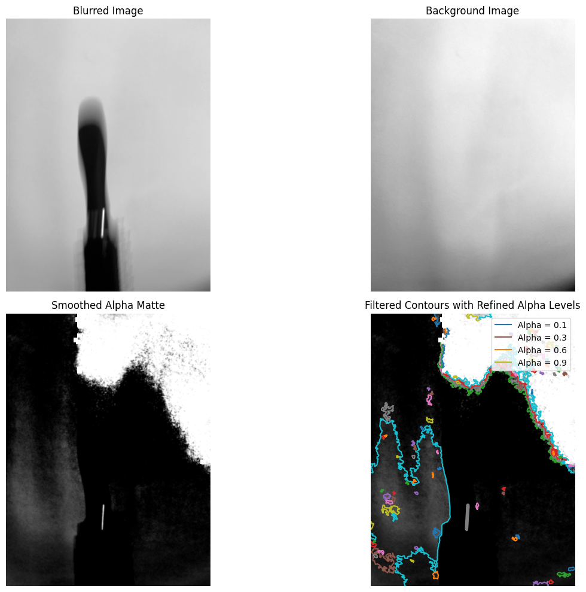
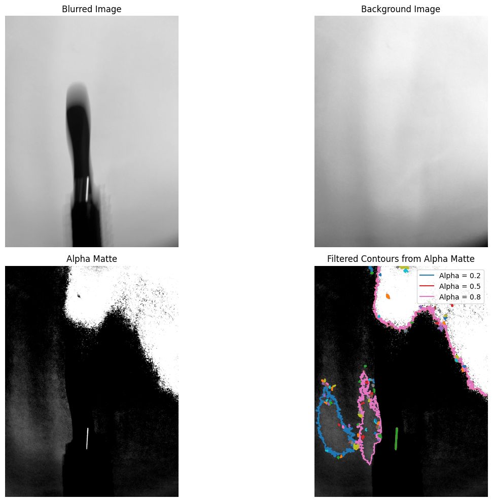
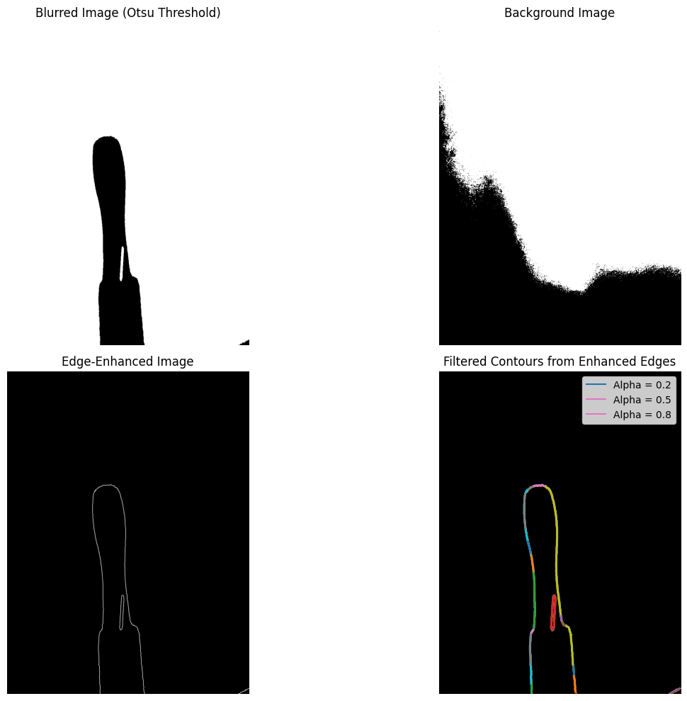

# 🌀 Motion-Blurred Object Detection

**Politecnico di Milano** — *IACV Course Project*\
**Project Topic F09:** Object detection in motion-blurred images\

[🔗 Course Website](https://magrilu.github.io/iacv/)\
[📄 Related Paper](https://link.springer.com/article/10.1007/s11263-008-0165-1)

---

## 🧠 Introduction

Motion blur occurs when objects move relative to a camera during exposure, creating streaked, semi-transparent images that hinder object detection. This is problematic in fields like autonomous driving, video surveillance, and robotics.

Inspired by the work of Caglioti and Giusti (IJCV, 2010), this project interprets blurred objects as semi-transparent overlays. Using **alpha matting**, we extract motion information from blurred frames — without requiring object deblurring.

## 🎯 Objectives

- Detect motion-blurred objects in images
- Estimate object transparency using alpha matting
- Track object motion trajectory across frames
- Apply method to both **synthetic** and **real-world** images

---

## 🧪 Problem Formulation

Blurred image formation is modeled as a time integration of sharp frames:

```math
C(x, y) = \int_{t_1}^{t_2} I(x_t, y_t, t) \cdot h(t) \, dt
```

This leads to the **matting equation**:

```math
C(x, y) = \alpha(x, y) \cdot F(x, y) + (1 - \alpha(x, y)) \cdot B(x, y)
```

Where:

- $C(x, y)\$: Captured image
- $F(x, y)\$: Moving object (foreground)
- $B(x, y)\$: Static background
- $\alpha(x, y)\$: Transparency map (alpha matte)

Using the assumption of a constant object intensity \(F\), the matte becomes:

```math
\alpha(x, y) = \frac{C(x, y) - B(x, y)}{F(x, y) - B(x, y) + \varepsilon}
```

---

## 🧩 Proposed Approach

1. **Capture blurred image + separate background**
2. **Estimate foreground ($F$)** using average of motion frames
3. **Compute alpha matte** **$\alpha\$**
4. **Extract contours** from $\alpha\$ map
5. **Track trajectory** from contour centroids

### Key Assumptions

- Foreground intensity remains approximately constant
- Background remains static
- Sharp object contours appear where \($\nabla \alpha > \tau\$)

---
### 🛠️ Pipeline

```text
📥 Acquire images
🧹 Preprocess (grayscale, smoothing)
➖ Subtract background
📐 Compute alpha matte
🔍 Detect contours
📈 Fit trajectory using polynomial regression
```

### ⚙️ Optimization

- Vectorized operations with NumPy
- Contour filtering by shape and area
- Illumination correction for shadow noise

---

## 🧪 Experimental Results

### Dataset

- **Real-world setup** using a falling comb
- Background image captured separately

### 📷 Visual Examples

- <div align="center"><div>
- <div align="center"><div>
- <div align="center"><div>


### 🎯 Outcome

- Robust trajectory estimation despite shadows
- Accurate object detection using alpha-based segmentation
- Refinement via morphological contour filtering

---

## 📊 Summary of Findings

| Step                   | Outcome                                  |
| ---------------------- | ---------------------------------------- |
| **Preprocessing**      | Enhanced contrast and removed noise      |
| **Alpha Matting**      | Extracted semi-transparent object shape  |
| **Contour Extraction** | Detected clean boundaries even with blur |
| **Trajectory Fitting** | Estimated smooth path of falling object  |

---

## 🚀 Future Work

- Extend to stereo vision for 3D trajectories
- Integrate deep learning for better alpha estimation
- Address occlusion in multi-object scenes

---

## 📚 Citation

> [Caglioti, V. & Giusti, A. (2010). *On the Apparent Transparency of a Motion Blurred Object*. International Journal of Computer Vision, 86(3), 243–255.](https://link.springer.com/article/10.1007/s11263-008-0165-1)

---

## 👨‍🏫 Course Info


**Course**: Image Analysis and Computer Vision (IACV)\
**University**: Politecnico di Milano — DEIB Department\
**Teacher**: Prof. Vincenzo Caglioti\
**Teaching Assistants**: Prof. Luca Magri, Prof. Federica Arrigoni\
**Website**: [https://magrilu.github.io/iacv/](https://magrilu.github.io/iacv/)

